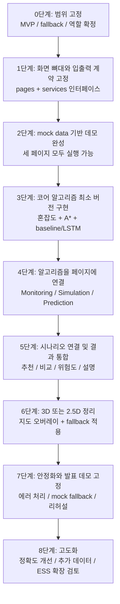
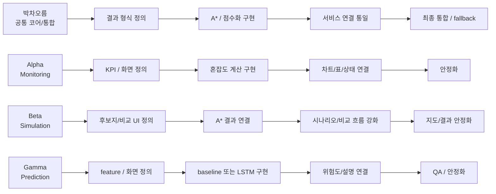

# SGOP 개발 흐름도

## 1. 전체 개발 흐름

## 2. 단계별 해야 할 일

### 0단계. 범위와 규칙 먼저 잠그기
목표:
- 팀이 같은 MVP를 보고 개발하도록 기준을 맞춘다.

해야 할 일:
- MVP 범위를 `Monitoring`, `Simulation`, `Prediction`, `지도 시각화`로 확정한다.
- `Optimization/ESS`는 후순위 확장으로 둔다.
- fallback을 먼저 정한다.
  - 3D 실패 시 `2.5D`
  - LSTM 지연 시 `baseline 예측`
  - 외부 API 실패 시 `mock data`
- 역할을 확정한다.
  - 박차오름: 공통 코어/통합
  - Alpha: Monitoring
  - Beta: Simulation
  - Gamma: Prediction

완료 기준:
- 팀원 모두가 “이번 주에 내가 뭘 보여줘야 하는지” 한 문장으로 말할 수 있다.

### 1단계. 화면 뼈대와 입출력 계약 고정
목표:
- 구현 전에 화면과 서비스의 계약을 먼저 고정한다.

해야 할 일:
- [app.py](app.py) 기준으로 전체 앱 진입 흐름을 유지한다.
- [01_monitoring.py](pages\01_monitoring.py), [02_simulation.py](pages\02_simulation.py), [03_prediction.py](pages\03_prediction.py)에 들어갈 입력/출력 항목을 문장으로 고정한다.
- 각 페이지가 호출할 서비스의 입력값과 반환값을 먼저 정한다.
  - Monitoring 서비스: 현재 상태, 혼잡도 지표, 위험 라인, 차트 데이터
  - Simulation 서비스: 후보지 입력, 경로, 추천 점수, 설치 전후 비교
  - Prediction 서비스: 시계열 입력, 예측값, 위험도, 설명 문구
- 공통 결과 형식을 박차오름이 먼저 정리한다.

완료 기준:
- 페이지 mock 없이도 “버튼 누르면 어떤 결과가 나와야 하는지” 팀이 합의되어 있다.

### 2단계. mock data 기준으로 세 페이지를 먼저 띄우기
목표:
- 알고리즘이 아직 완성되지 않아도 전체 앱이 돌아가는 상태를 만든다.

해야 할 일:
- `data/mock` 기준으로 테스트용 데이터 구조를 만든다.
- Monitoring 담당은 차트, 상태 표, 위험 배지를 mock으로 출력한다.
- Simulation 담당은 후보지 입력, 설치 전후 비교 카드, 결과 표를 mock으로 출력한다.
- Prediction 담당은 예측 그래프, 위험도 카드, 설명 카드를 mock으로 출력한다.
- 박차오름은 페이지와 서비스 연결 방식만 먼저 통일한다.

완료 기준:
- 세 페이지가 모두 열리고, mock 기준 데모가 된다.

### 3단계. 코어 알고리즘 최소 버전 구현
목표:
- 보여주기용 mock이 아니라 실제 계산값이 한 번은 나오게 만든다.

해야 할 일:
- 박차오름:
  - [astar_router.py](src\engine\search\astar_router.py) 최소 버전 구현
  - [score_function.py](src\engine\search\score_function.py) 초안 구현
  - 공통 결과 포맷 통일
- Alpha:
  - [dc_power_flow.py](src\engine\powerflow\dc_power_flow.py) 최소 버전 구현
  - [congestion_metrics.py](src\engine\powerflow\congestion_metrics.py) 최소 버전 구현
- Gamma:
  - [feature_builder.py](src\engine\forecast\feature_builder.py) 구현
  - baseline 또는 [lstm_forecaster.py](src\engine\forecast\lstm_forecaster.py) 최소 버전 구현
- Beta:
  - Simulation 페이지가 A* 결과와 연결될 수 있도록 입력/결과 구조 정리

완료 기준:
- 혼잡도 계산값 1개, 경로 결과 1개, 예측 그래프 1개가 실제 값으로 출력된다.

### 4단계. 알고리즘을 페이지와 서비스에 연결
목표:
- 엔진이 따로 노는 게 아니라 화면에서 바로 보이게 만든다.

해야 할 일:
- Monitoring 담당:
  - 계산 결과를 차트, 표, 위험 상태로 연결
  - [monitoring_service.py](src\services\monitoring_service.py) 연결 정리
- Simulation 담당:
  - A* 결과를 설치 전후 비교 흐름에 연결
  - [simulation_service.py](src\services\simulation_service.py) 연결 정리
- Prediction 담당:
  - 예측값, 위험도, 설명 문구를 화면에 연결
  - [prediction_service.py](src\services\prediction_service.py) 연결 정리
- 박차오름:
  - 세 서비스의 반환 포맷을 통일
  - 결과를 한 시나리오 기준으로 이어지게 조정

완료 기준:
- 각 페이지가 mock이 아니라 실제 서비스 결과를 사용한다.

### 5단계. 시나리오 기반 통합 흐름 만들기
목표:
- 사용자가 “현재 상태 확인 -> 후보지 넣기 -> 결과 비교 -> 예측 확인” 순서로 경험할 수 있게 만든다.

해야 할 일:
- 시뮬레이션 입력과 모니터링 상태를 같은 데이터 기준으로 묶는다.
- 예측 결과가 시뮬레이션 또는 모니터링과 연결되도록 시나리오 기준을 맞춘다.
- 추천 결과 상위안, 비교 결과, 위험도 설명을 한 흐름으로 묶는다.
- 필요하면 [scenario_service.py](src\services\scenario_service.py) 기준으로 저장/불러오기 흐름을 붙인다.

완료 기준:
- 한 시나리오를 기준으로 Monitoring, Simulation, Prediction이 이어진다.

### 6단계. 지도 시각화와 3D fallback 정리
목표:
- 발표에서 SGOP의 차별점이 보이도록 공간 정보 표현을 완성한다.

해야 할 일:
- VWorld 또는 대체 시각화 방식으로 후보지, 경로, 상태 변화를 표시한다.
- `2026-04-05` 이전 feasibility 결과에 따라 다음 둘 중 하나를 택한다.
  - 3D 가능: 3D 지도/레이어 유지
  - 3D 불안정: 2.5D 또는 2D 지도 표현으로 전환
- 지도 오버레이와 데이터 표현이 페이지별 결과와 맞게 보이도록 정리한다.

완료 기준:
- 지도에서 후보지, 경로, 상태 변화 중 핵심 요소가 발표 수준으로 보인다.

### 7단계. 안정화와 발표 데모 고정
목표:
- 발표 때 끊기지 않는 데모를 만든다.

해야 할 일:
- 외부 API 실패 시 mock data fallback 확인
- 예측 실패 시 baseline 전환 확인
- 입력 오류, 빈 데이터, 로딩 상태, 예외 메시지 정리
- 발표용 핵심 시나리오 1개를 고정
- 팀원별 발표 파트와 데모 순서 정리

완료 기준:
- 발표 흐름이 끊기지 않는다.

### 8단계. 고도화와 확장
목표:
- MVP 이후 여유 시간으로 품질을 올린다.

해야 할 일:
- A* 비용 함수 개선
- 점수화 가중치 조정
- LSTM 성능 보정 또는 데이터 확대
- 설명 기능 품질 개선
- `Optimization/ESS` 확장 여부 검토

완료 기준:
- 완성도는 올라가되, 기존 MVP 데모는 절대 깨지지 않는다.

## 3. 사람별 개발 흐름

## 4. 주간 체크포인트
- `2026-04-05`
  - 세 페이지가 mock 기준으로 열린다.
  - 역할별 입출력 형식이 고정된다.
- `2026-04-12`
  - 실제 계산값으로 혼잡도, 경로, 예측 그래프가 각 1개씩 나온다.
- `2026-04-19`
  - 현재 상태 확인부터 예측 확인까지 한 흐름이 이어진다.
- `2026-04-26`
  - 세 페이지가 같은 시나리오 기준으로 연결된다.
- `2026-05-03`
  - 발표용 데모 시나리오가 끊기지 않는다.
- `2026-05-10`
  - MVP 완료

## 5. 실전 운영 원칙
- 작업 순서는 항상 `계약 정의 -> mock -> 최소 구현 -> 실제 연결 -> 안정화` 순서로 간다.
- 정확도보다 먼저 `실행 가능한 파이프라인`을 만든다.
- 막히면 대기하지 말고 fallback으로 우회한다.
- 금요일마다 “이번 주에 실제로 돌아가는 장면”이 있어야 한다.
